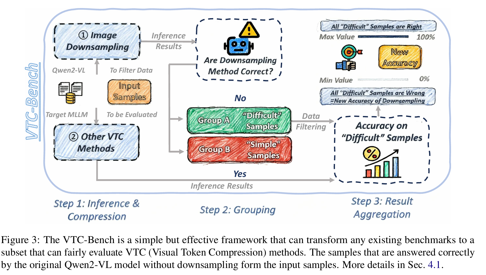

# <p align="center"><strong>Are We Using the Right Benchmark: An Evaluation Framework for Visual Token Compression Methods</strong></p>
<div align="center">


[](https://arxiv.org/abs/2510.07143)

[Chenfei Liao<sup>1,2,6](https://chenfei-liao.github.io/)</sup> Wensong Wang<sup>3,2</sup> [Zichen Wen<sup>2,5](https://github.com/ZichenWen1)</sup> [Xu Zheng<sup>1,4,6](https://zhengxujosh.github.io/)</sup> Yiyu Wang<sup>2</sup> Haocong He<sup>2</sup> \
[Yuanhuiyi Lyu<sup>1,6](https://qc-ly.github.io/)</sup> [Lutao Jiang<sup>1,6](https://lutao2021.github.io/)</sup> Xin Zou<sup>1,6</sup> [Yuqian Fu<sup>4](https://yuqianfu.com/)</sup> [Bin Ren<sup>7,8,4](https://amazingren.github.io/) </sup>Linfeng Zhang<sup>2,📧</sup> Xuming Hu<sup>1,6,📧</sup>

</div>

<div align="center">
  
<sup>1</sup>Hong Kong University of Science and Technology (Guangzhou) <sup>2</sup>Shanghai Jiao Tong University \
<sup>3</sup>Northeastern University <sup>4</sup>INSAIT, Sofia University “St. Kliment Ohridski” \
<sup>5</sup>Shanghai AI Laboratory <sup>6</sup>Hong Kong University of Science and Technology\
<sup>7</sup>University of Pisa <sup>8</sup>University of Trento
  
</div>

<div align="center">
    
</div>
  
## Abstract 

Recent endeavors to accelerate inference in Multimodal Large Language Models (MLLMs) have primarily focused on visual token compression. The effectiveness of these methods is typically assessed by measuring the accuracy drop on established benchmarks, comparing model performance before and after compression. However, these benchmarks are originally designed to assess the perception and reasoning capabilities of MLLMs, rather than to evaluate compression techniques. As a result, directly applying them to visual token compression introduces a task mismatch. Strikingly, our investigation reveals that simple image downsampling consistently outperforms many advanced compression methods across multiple widely used benchmarks. Through extensive experiments, we make the following observations: (i) Current benchmarks are noisy for the visual token compression task. (ii) Down-sampling is able to serve as a data filter to evaluate the difficulty of samples in the visual token compression task. Motivated by these findings, we introduce VTC-Bench, an evaluation framework that incorporates a data filtering mechanism to denoise existing benchmarks, thereby enabling fairer and more accurate assessment of visual token compression methods. 


## Data Link

All inference results can be downloaded in [OneDrive](https://hkustgz-my.sharepoint.com/:u:/g/personal/cliao127_connect_hkust-gz_edu_cn/EeAPW8i_QwFHlFQyeBjM8J8BghWZQaghSVVgvGCyfvcasg?e=vRBxlp)


## Quick Start

### Step1 Run the downsampled methods

Based on [DART](https://github.com/ZichenWen1/DART):

Replace the qwen2_vl.py of the original lmms_eval files to [ours](qwen2_vl.py).

### Step2 Run the methods waited for evaluation

For DART, based on [DART](https://github.com/ZichenWen1/DART).

For FastV, VisionZip, PruMerge+, based on [EffiVLM-Bench](https://github.com/EffiVLM-Bench/EffiVLM-Bench).

### Step3 Analyze data and calculate
```
Data list
├── Llava-ov-7B
  ├── Downsample
    ├── 1
      📄 xxx.jsonl
    ├── 2
    ├── 3
    ├── 4
    ├── 5
    ├── 10
  ├── VisionZip
    ├── 0.01
    ├── 0.04
    ├── 0.0625
    ├── 0.1111
    ├── 0.25
  ├── PruMerge+
  ├── FastV
├── Qwen2-VL-7B-Instruct
  ├── Downsample
  ├── VisionZip
  ├── PruMerge+
  ├── FastV
  ├── DART
```

```
python analyze_results.py --batch_mode --models Qwen2-VL-7B-Instruct Llava-ov-7B --methods dart fastv prumerge+ visionzip --downsamples 2 3 4 5 10
```


## Contact

If you have any problems, please contact:

📧 cliao127@connect.hkust-gz.edu.cn

We will response and fix the problems ASAP! Thanks!

## Citations

If you find this project helpful, please consider citing the following paper:
```
@misc{liao2025usingrightbenchmarkevaluation,
      title={Are We Using the Right Benchmark: An Evaluation Framework for Visual Token Compression Methods}, 
      author={Chenfei Liao and Wensong Wang and Zichen Wen and Xu Zheng and Yiyu Wang and Haocong He and Yuanhuiyi Lyu and Lutao Jiang and Xin Zou and Yuqian Fu and Bin Ren and Linfeng Zhang and Xuming Hu},
      year={2025},
      eprint={2510.07143},
      archivePrefix={arXiv},
      primaryClass={cs.CV},
      url={https://arxiv.org/abs/2510.07143}, 
}
```
