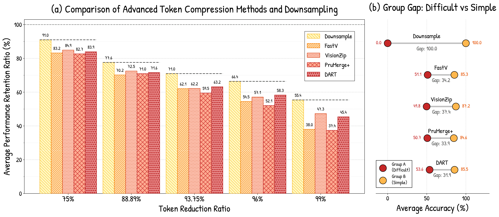
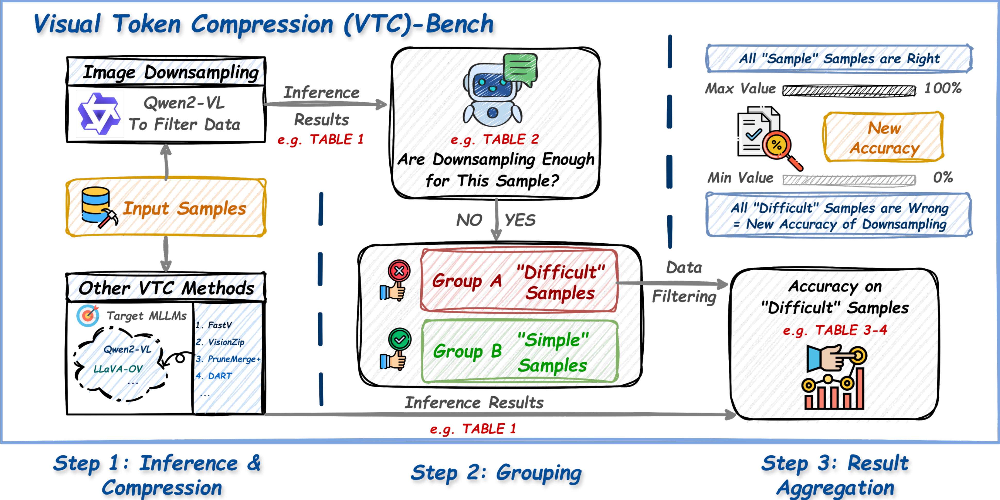

# <p align="center"><strong>Are We Using the Right Benchmark: An Evaluation Framework for Visual Token Compression Methods</strong></p>
<div align="center">

[](https://chenfei-liao.github.io/VTC-Bench-Page/)
[](https://arxiv.org/abs/2510.07143)
[](https://opensource.org/licenses/Apache-2.0)

[Chenfei Liao<sup>1,2,6](https://chenfei-liao.github.io/)</sup> [Wensong Wang<sup>3,2](https://scholar.google.com/citations?hl=en&user=2zrWveUAAAAJ)</sup> [Zichen Wen<sup>2,5](https://github.com/ZichenWen1)</sup> [Xu Zheng<sup>1,4,6](https://zhengxujosh.github.io/)</sup> [Yiyu Wang<sup>2](https://github.com/lern-to-write/)</sup> [Haocong He<sup>2](https://openreview.net/profile?id=%7EHaocong_He1)</sup> \
[Yuanhuiyi Lyu<sup>1,6](https://qc-ly.github.io/)</sup> [Lutao Jiang<sup>1,6](https://lutao2021.github.io/)</sup> [Xin Zou<sup>1,6](https://scholar.google.com/citations?user=z39tx_sAAAAJ)</sup> [Yuqian Fu<sup>4](https://yuqianfu.com/)</sup> [Bin Ren<sup>7,8,4](https://amazingren.github.io/)</sup> [Linfeng Zhang<sup>2,📧](https://www.zhanglinfeng.tech/index_chinese.html)</sup> [Xuming Hu<sup>1,6,📧](https://xuminghu.github.io/)</sup>

</div>

<div align="center">
  
<sup>1</sup>Hong Kong University of Science and Technology (Guangzhou) <sup>2</sup>Shanghai Jiao Tong University \
<sup>3</sup>Northeastern University <sup>4</sup>INSAIT, Sofia University “St. Kliment Ohridski” \
<sup>5</sup>Shanghai AI Laboratory <sup>6</sup>Hong Kong University of Science and Technology\
<sup>7</sup>University of Pisa <sup>8</sup>University of Trento
  
</div>

## 🚩 News
- **[2026.04.06]** 📝 Our paper is accepted by ACL 2026 Main Track!
- **[2026.04.03]** 🚀 **VTC-Bench v1.1** is released! We have completed a full code refactor for better usability and performance. 
- **[2026.01.23]** 📝 Our updated paper is now available on [arXiv](https://arxiv.org/abs/2510.07143).
- **[2026.10.08]** 🚀 **VTC-Bench v1.0** is released!
- **[2025.10.08]** 📝 Our paper is now available on [arXiv](https://arxiv.org/abs/2510.07143).

## Abstract

Recent efforts to accelerate inference in Multimodal Large Language Models (MLLMs) have largely focused on visual token compression. The effectiveness of these methods is commonly evaluated by measuring the accuracy drop on existing MLLM benchmarks before and after compression. However, these benchmarks are originally designed to assess general perception and reasoning abilities, rather than the specific challenges posed by visual token compression, leading to a fundamental task mismatch.

In this work, we uncover a counterintuitive yet consistent phenomenon: **simple image downsampling outperforms many advanced visual token compression methods across multiple widely used benchmarks**.

Through a comprehensive empirical study spanning eight popular benchmarks and multiple state-of-the-art compression techniques, we show that (i) current benchmarks contain substantial noise (task-irrelevant samples) for evaluating visual token compression, and (ii) downsampling can act as an effective data filter that distinguishes between simple and difficult samples with respect to compression sensitivity.

Motivated by these findings, we propose **VTC-Bench**, an evaluation framework that explicitly leverages downsampling as a discriminator to denoise existing benchmarks, enabling a fairer and more meaningful additional assessment of visual token compression methods.

## Motivation

Some recent MLLMs, such as Qwen2-VL and Qwen2.5-VL, natively support inputs of varying resolutions. A trivial yet efficient method to handle high-resolution images is to simply downsample them to a lower resolution. However, most token compression methods for MLLMs choose to adaptively drop useless tokens or merge similar tokens instead of directly downsampling the original image, which theoretically should be more intelligent.

Surprisingly, we find that **image downsampling consistently exceeds other sophisticated methods under some settings.** Based on comprehensive experiments, we propose a bold hypothesis:

*Some data in the existing benchmarks is overly simplistic and irrelevant to evaluating visual token compression methods, leading to the unreasonable phenomenon that even the downsampling method is sufficient to deal with the visual token compression task.*

<div align="center">
    
</div>

To validate this, we design a data-centric analysis using downsampling as a discriminator. We identify two crucial findings:
1. **Current benchmarks are noisy for the visual token compression task.** Many samples can be answered correctly even with significant downsampling, indicating they do not test fine-grained visual understanding.
2. **Downsampling can serve as a data filter.** By separating samples into "simple" (Group B) and "difficult" (Group A) based on whether downsampling succeeds, we can effectively distinguish samples that truly require advanced compression.

## VTC-Bench Framework

Based on these findings, we propose VTC-Bench, a new evaluation framework specifically designed to optimize and denoise current existing benchmarks. By explicitly distinguishing between “simple” and “difficult” samples through downsampling, VTC-Bench adaptively selects "difficult" samples that satisfy the requirements of evaluating visual token compression methods.

<div align="center">
    
</div>

The pipeline consists of three critical steps:
- **Step 1: Inference & Compression.** Given a sample and a target token compression ratio, we run two inference pipelines: (1) a downsampling baseline (the filter) and (2) advanced visual token compression methods (e.g., FastV, VisionZip, DART) evaluated directly on the target MLLM.
- **Step 2: Grouping.** We use the performance of the downsampling method as a binary discriminator to categorize samples:
  - **Group A (Difficult Samples):** Samples that are answered incorrectly by the downsampling method.
  - **Group B (Simple Samples):** Samples that are answered correctly by the downsampling method.
  This step filters the existing benchmarks and removes noisy data that is not applicable for evaluating the visual token compression methods.
- **Step 3: Result Aggregation.** We perform a statistical analysis on the accuracy of the "difficult" samples to obtain an indicator that truly reflects the capability of visual compression methods.

## Data Link

All inference results (raw data) can be downloaded in [OneDrive](https://hkustgz-my.sharepoint.com/:u:/g/personal/cliao127_connect_hkust-gz_edu_cn/EeAPW8i_QwFHlFQyeBjM8J8BghWZQaghSVVgvGCyfvcasg?e=vRBxlp).

Final evaluation results can be found in [Final_Results](Final_Results.csv).


## Quick Start

### Environment
```
 conda create -n VTC python=3.10 -y
 conda activate VTC
 cd Qwen2-VL/transformers && pip install -e .
 pip install accelerate qwen-vl-utils[decord]
 pip install flash-attn --no-build-isolation
 cd ../../lmms-eval && pip install -e .
 pip install qwen-vl-utils
 pip install flash-attention-softmax-n
 ```

### Step1 Run the downsampled methods

```
bash scripts/dart.sh false [downsample_ratio]
```
### Step2 Run the methods waited for evaluation

```
bash scripts/dart.sh true 1 [reduction_ratio]
bash scripts/effivlm.sh 1 [reduction_ratio]
```

### Step3 Analyze data and calculate
```
python tools/reorganize_data.py
```

```
Data list
├── Qwen2-VL-7B-Instruct
  ├── Downsample
    ├── 1
      📄 xxx.jsonl
    ├── 2
    ├── 3
    ├── 4
    ├── 5
    ├── 10
  ├── VisionZip
    ├── 0.01
    ├── 0.04
    ├── 0.0625
    ├── 0.1111
    ├── 0.25
  ├── PruMerge+
  ├── FastV
├── Llava-ov-7B
  ├── Downsample
  ├── VisionZip
  ├── PruMerge+
  ├── FastV
  ├── DART
```

```
python tools/analyze_results.py --all
```


## Contact

If you have any problems, please contact:

📧 cliao127@connect.hkust-gz.edu.cn

We will response and fix the problems ASAP! Thanks!

## Citations

If you find this project helpful, please consider citing the following paper:
```
@article{liao2026usingrightbenchmarkevaluation,
  title={Are We Using the Right Benchmark: An Evaluation Framework for Visual Token Compression Methods},
  author={Liao, Chenfei and Wang, Wensong and Wen, Zichen and Zheng, Xu and Wang, Yiyu and He, Haocong and Lyu, Yuanhuiyi and Jiang, Lutao and Zou, Xin and Fu, Yuqian and Ren, Bin and Zhang, Linfeng and Hu, Xuming},
  journal={arXiv preprint arXiv:2510.07143},
  year={2026}
}
```

## Star History

[](https://www.star-history.com/#Chenfei-Liao/VTC-Bench&type=date&logscale&legend=top-left)
